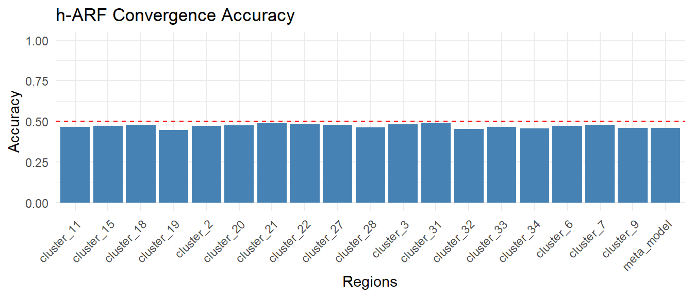
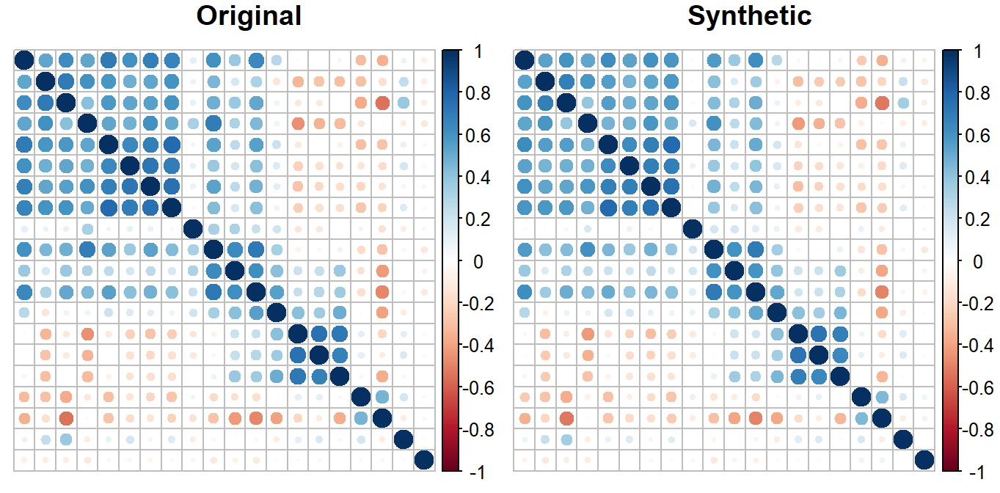
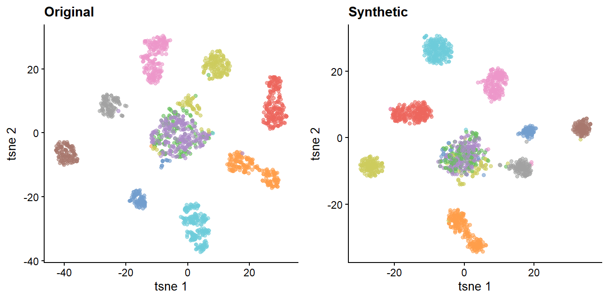
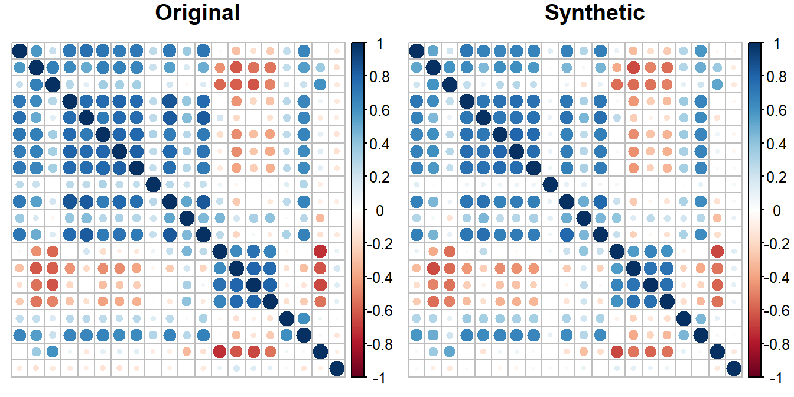
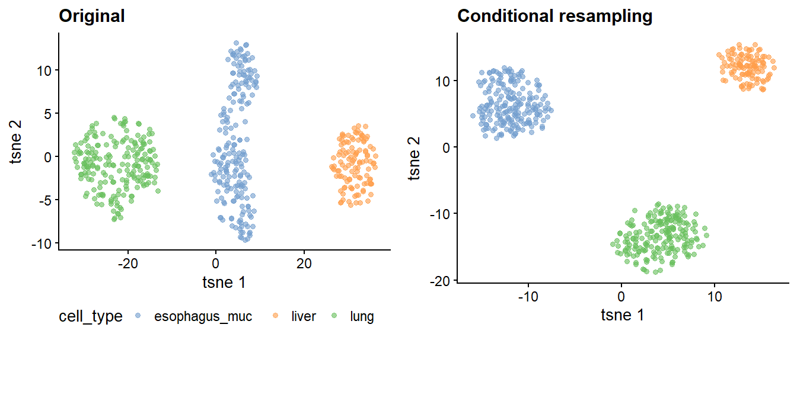

# How does harf work?

## Introduction

The R package **harf** extends adversarial random forests (ARFs) to
high-dimensional data. This vignette serves as a user guide to use the
package effectively. Two key functionalities are provided: `h_arf` to
train and estimate densities in a high-dimensional adversarial random
forest ($`h`$-ARF), and `h_forge` for the synthetic data generating
process. Unconditional and conditional data generating processes are
supported. The package is designed to handle high-dimensional omics
data, such as gene expression measurements, and can be applied to
various downstream analyses, including clustering (unsupervised) and
classification to generate synthetic data (supervised). For clustering,
we illustrate the usage of the **harf** package using a single-cell
RNA-seq dataset, where the goal is to generate synthetic data that
preserves the underlying structure of the original data. For prediction,
illustration is made based on gene expression data, with the goal to
synthesize gene expression data that can be used to assess the
performance of a prediction models in the absence of original datasets.
Such a situation typically arise when research face sample size
limitation and do not have enough of data to built and evaluate their
prediction model.

## Unsupervised data generating process

The package single cell built-in dataset `single_cell` used in this
vignette originate from The Cancer Genome Atlas (TCGA) and the
Genotype-Tissue Expression (GTEx) projects, two large-scale public
resources providing extensive RNA-seq data. The data were extracted from
previously processed and curated datasets generated using the pipeline
described in Aguet et al. (2017). This pipeline ensures log-transformed
gene measurements, expressed in at least $`6\%`$ of cells. To keep the
computational burden manageable for this vignette, we randomly selected
$`80`$ genes and $`1652`$ from the original dataset. The included cells
are grouped by human organes, including bladder, breast, cervix, colon,
esophagus (gastroesophageal junction, mucosa, muscularis), kidney,
liver, lung, prostate, salivary gland, stomach, thyroid, and uterus. The
variable `cell_type` indicates the tissue of origin for each cell.

The following code requires some packages to be installed.

``` r
install.packages("data.table")
install.packages("rsvd")
install.packages("Rtsne")
install.packages("cowplot")
if (!require("BiocManager", quietly = TRUE))
  install.packages("BiocManager")
BiocManager::install("SingleCellExperiment")
BiocManager::install("scater")
install.packages("pROC")
install.packages("caret")
install.packages("ranger")
install.packages("ggplot2")
install.packages("corrplot")
install.packages("doParallel")
```

We load the required libraries.

``` r
library(harf)
library(data.table)
library(rsvd)
library(Rtsne)
library(cowplot)
library(SingleCellExperiment)
library(ggplot2)
library(corrplot)
library(scater)
library(pROC)
library(caret)
library(doParallel)
```

In genetic epidemiology studies, molecular (omics) data are typically
accompanied by clinical or phenotypic variables that provide essential
contextual information. The $`h`$-ARF framework assumes that input data
consist of two components: (i) high-dimensional numeric omics features
and (ii) associated clinical or phenotypic variables, which may be mixed
(categorical or numeric). In the following example, gene expression
measurements are used as the omics data, while cell type serves as the
labor information. Our first aim is to train a generative model to
generate synthetic data that preserves the underlying structure of the
original data, including the correlation structure between features and
the cluster structure of cells.

``` r
data("single_cell")
chunk_size <- 5
```

We set the chunk size size to 5 for illustration, but in practice, users
may need to tune this parameter to achieve a predefined level, for a
given performance measure.

### High-dimensional adversarial game

We train a $`h`$-ARF model using the `h_arf` function. The gene
expression measurements are provided as the `omx_data` argument, while
the cell type information is passed as the `cli_lab_data` argument. We
set the maximal chunk size to 5, to specify that maximal number of
features allowed in an isolated region. This parameter is crucial for
three main aspects, including (i) controlling the convergence of ARF in
the isolated regions, (ii) learning the joint pattern between features,
and (iii) managing the runtime.

``` r
my_omx_data <- single_cell[ , - which(colnames(single_cell)  == "cell_type")]
my_cli_lab_data <- data.frame(cell_type = single_cell$cell_type)
harf_model <- h_arf(
 omx_data = my_omx_data,
 cli_lab_data = my_cli_lab_data,
 feature_ordering = colnames(single_cell),
 parallel = FALSE,
 chunk_size = chunk_size,
 verbose = TRUE
)
#> Iteration: 0, Accuracy: 77.86%
#> Iteration: 1, Accuracy: 45.87%
#> Iteration: 0, Accuracy: 86.56%
#> Iteration: 1, Accuracy: 47.4%
#> Iteration: 0, Accuracy: 85.36%
#> Iteration: 1, Accuracy: 48.34%
#> Iteration: 0, Accuracy: 82.59%
#> Iteration: 1, Accuracy: 47.35%
#> Iteration: 0, Accuracy: 85.9%
#> Iteration: 1, Accuracy: 47.96%
#> Iteration: 0, Accuracy: 82.84%
#> Iteration: 1, Accuracy: 46.07%
#> Iteration: 0, Accuracy: 86.93%
#> Iteration: 1, Accuracy: 51.44%
#> Iteration: 2, Accuracy: 46.78%
#> Iteration: 0, Accuracy: 89.29%
#> Iteration: 1, Accuracy: 50.87%
#> Iteration: 2, Accuracy: 47.28%
#> Iteration: 0, Accuracy: 87.25%
#> Iteration: 1, Accuracy: 53.55%
#> Iteration: 2, Accuracy: 47.88%
#> Iteration: 0, Accuracy: 84.92%
#> Iteration: 1, Accuracy: 44.72%
#> Iteration: 0, Accuracy: 86.39%
#> Iteration: 1, Accuracy: 47.54%
#> Iteration: 0, Accuracy: 82.95%
#> Iteration: 1, Accuracy: 48.75%
#> Iteration: 0, Accuracy: 85.69%
#> Iteration: 1, Accuracy: 48.42%
#> Iteration: 0, Accuracy: 81.66%
#> Iteration: 1, Accuracy: 47.9%
#> Iteration: 0, Accuracy: 81.52%
#> Iteration: 1, Accuracy: 46.26%
#> Iteration: 0, Accuracy: 86.78%
#> Iteration: 1, Accuracy: 49.27%
#> Iteration: 0, Accuracy: 84.67%
#> Iteration: 1, Accuracy: 50.14%
#> Iteration: 2, Accuracy: 45.39%
#> Iteration: 0, Accuracy: 85.79%
#> Iteration: 1, Accuracy: 52.05%
#> Iteration: 2, Accuracy: 46.67%
#> Iteration: 0, Accuracy: 86.91%
#> Iteration: 1, Accuracy: 50.77%
#> Iteration: 2, Accuracy: 45.71%
str(harf_model,max.level = 1)
#> List of 10
#>  $ meta_model       :List of 3
#>  $ cor_matrix       : NULL
#>  $ models           :List of 18
#>  $ cluster          :'data.frame':   80 obs. of  2 variables:
#>  $ meta_features    :'data.frame':   1652 obs. of  3 variables:
#>  $ omx_features     : chr [1:80] "V1" "V2" "V3" "V4" ...
#>  $ cli_lab_features : chr "cell_type"
#>  $ omx_constant_data: NULL
#>  $ feature_ordering : chr [1:81] "cell_type" "V1" "V2" "V3" ...
#>  $ accuracy         : Named num [1:19] 0.459 0.474 0.483 0.474 0.48 ...
#>   ..- attr(*, "names")= chr [1:19] "meta_model" "cluster_2" "cluster_3" "cluster_6" ...
#>  - attr(*, "class")= chr "harf"
```

### Inspect accuracy of the $`h`$-ARF model

We plot the accuracy of the $`h`$-ARF model across the training regions
and the meta region to ensure that the adversarial game has converged
properly. An accuracy lesser than $`0.5`$ indicates that the ARF model
locally converged, i.e. it stopped because it had not been able to
distinguish between original and synthetic data. In contrast, an
accuracy larger than $`0.5`$ indicates that the ARF did not locally
converge. We recommend to set the chunk size parameter such that the
local ARF model converge.

``` r
acc_df <- data.frame(
  Region = names(harf_model$accuracy),
  Accuracy = harf_model$accuracy
)
acc_plot <- ggplot2::ggplot(acc_df, ggplot2::aes(x = Region, y = Accuracy)) +
  ggplot2::geom_hline(yintercept = 0.5, linetype = "dashed", color = "red") +
  ggplot2::geom_bar(stat = "identity", fill = "steelblue") +
  ggplot2::ylim(0, 1) +
  ggplot2::labs(title = "h-ARF Convergence Accuracy",
                x = "Regions",
                y = "Accuracy") +
  ggplot2::theme_minimal() +
  ggplot2::theme(axis.text.x = ggplot2::element_text(angle = 45, hjust = 1))
acc_plot
```



### Generating synthetic data

We use the `h_forge` function to generate sznthsize single cell data
using the trained $`h`$-ARF model. Here, we generate the same number of
synthetic samples as in the original dataset, and without any evidence,
i.e. without any prio information regarding the the single cell classes
(`evidence = NULL`). As we will see later, the `evidence` argument can
be used to generate synthetic data conditionally on a specific cell
types. The generated synthetic data are stored in the
`synth_single_cell` object.

``` r
set.seed(32)
synth_single_cell <- h_forge(
  harf_obj = harf_model,
  n_synth = nrow(single_cell), 
  evidence = NULL,
  parallel = FALSE,
  verbose = FALSE
  )
```

### Comparaison of correlation matrices

We visually compare the correlation matrices of the original data and
the synthetic data. To enhance interpretability, we rearrange the
features according to their region assignments obtained from the
$`h`$-ARF model. The correlation plots exhibit similar patterns across
the three datasets, indicating that the $`h`$-ARF model effectively
preserve the origin feature correlation structure.

``` r
# Re-arrange data by grouping gene by clusters
cluster_feature <- copy(harf_model$cluster)
setorder(cluster_feature, cluster)
orig_clustered <- single_cell[ , c("cell_type", cluster_feature$feature)]
synth_clustered <- as.data.frame(synth_single_cell)[ , c("cell_type", cluster_feature$feature)]
plot_corr <- function(dt, title) {
  corr_matrix <- cor(dt[ , 2:21], method = "spearman")
  corrplot(corr_matrix,
           method = "circle",
           tl.col = "black",
           tl.pos = "n",
           title = title,
           mar = c(0, 0, 1, 0))
}
```

### Show original and synthetic data in 2D using t-SNE

We use t-SNE to visualize cells in a two-dimensional space. Original
cell clusters are preserved in the synthetic data, indicating that the
$`h`$-ARF model effectively captures the underlying cluster structure of
the original data.

``` r
tsne_it <- function (sc_data, perp = 30, title = "") {
  # Create SingleCellExperiment object
  sce <- SingleCellExperiment::SingleCellExperiment(
    assays = list(counts = t(as.matrix(sc_data[ , - which(colnames(sc_data)  == "cell_type")])))
  )
  SingleCellExperiment::logcounts(sce) <- SingleCellExperiment::counts(sce) # Log-normalization
  sce$cell_type <- sc_data$cell_type
  pc_sce <- rpca(t(SingleCellExperiment::counts(sce)))
  # tSNE with rotated pcs
  ts_sce <- Rtsne::Rtsne(
    pc_sce$x %*% pc_sce$rotation,
    perplexity = perp,
    verb = FALSE,
    pca = FALSE,
    check_duplicates = FALSE
  )
  SingleCellExperiment::reducedDim(sce, "tsne") = ts_sce$Y
  sce_plot <- scater::plotReducedDim(sce, "tsne", colour_by = "cell_type") + 
  ggplot2::ggtitle(title) +
  ggplot2::theme(legend.position = "bottom")
  return(sce_plot)
}  
orig_plot <- tsne_it(single_cell,
                     perp = 30,
                     title = "Original")
synth_plot <- tsne_it(as.data.frame(synth_single_cell),
                      perp = 30,
                      title = "Synthetic")
legend <- cowplot::get_legend(
  orig_plot + theme(legend.position = "bottom")
)
orig_plot <- orig_plot + theme(legend.position = "none")
synth_plot <- synth_plot + theme(legend.position = "none")
all_plots <- cowplot::plot_grid(orig_plot,
                                synth_plot,
                                ncol = 2)
par(mfrow = c(1,2))
plot_corr(orig_clustered, "Original")
plot_corr(synth_clustered, "Synthetic")
```



``` r
par(mfrow = c(1, 1))
print(all_plots)
```



### Conditional resampling

The `evidence` parameter is required for conditional resampling. We
generate synthetic samples for each cell typ separately. The generated
samples are then combined to form the final synthetic dataset. For these
example, we synthesize lung, liver and esophagus mucosa cell types. Both
the correlation structure and the cluster structure are well preserved
in the conditionally generated synthetic data.

``` r
sub_cell_type <- c("lung", "liver", "esophagus_muc")
single_cell_list <- lapply(sub_cell_type, function (ct) {
  ct_synth <- h_forge(
        harf_obj = harf_model,
        n_synth = sum(single_cell$cell_type == ct),
        evidence = data.frame(cell_type = ct),
        verbose = FALSE,
        parallel = FALSE
      )
  return(ct_synth)
})
cond_synth_single_cell <- do.call(rbind, single_cell_list)
cond_synth_clustered <- as.data.frame(cond_synth_single_cell)[ , c("cell_type", cluster_feature$feature)]
cond_synth_plot <- tsne_it(as.data.frame(cond_synth_single_cell),
                           perp = 30,
                           title = "Conditional resampling")
sub_legend <- cowplot::get_legend(
  cond_synth_plot + theme(legend.position = "none")
)
cond_synth_plot <- cond_synth_plot + theme(legend.position = "none")
sub_single_cell <- orig_clustered[orig_clustered$cell_type %in% sub_cell_type , ]
sub_orig_plot <- tsne_it(sub_single_cell,
                     perp = 30,
                     title = "Original")
legend <- cowplot::get_legend(
  orig_plot + theme(legend.position = "bottom")
)
sub_all_plots <- cowplot::plot_grid(sub_orig_plot,
                                cond_synth_plot,
                                ncol = 2)
par(mfrow = c(1,2))
plot_corr(sub_single_cell, "Original")
plot_corr(cond_synth_clustered, "Synthetic")
```



``` r
par(mfrow = c(1, 1))
plot_grid(sub_all_plots, sub_legend, ncol = 1, rel_heights = c(1, 0.2))
```



``` r
par(mfrow = c(1, 1))
```

Again, both the correlation structure and the cluster structure are well
preserved in the conditionally generated synthetic data.

## Supervised data generating process

The goal is to generate synthetic gene expression data that can be used
to evaluate the performance of a prediction model in the absence of
original testing datasets, in a situation in which researchers may not
have enough samples for eventual internal validation such as
corss-validation. As supervised downstream analysis example, we consider
the Cancer Genome Atlas Kidney Chromophobe Collection (TCGA-KICH) gene
expression predictors, with artificial tumor stage as binary response
variable, since the provided original tumor stages were difficult to
predict. The dataset contains $`66`$ samples and the top $`140`$ gene
expression with the highest empirical variances. We include age and
gender as additional clinical variables. We scale gene expressions and
age. To create the response variable, we fix age and the first $`10`$
gene expression variables to drive an effect. We set the effect of age
to $`0.5`$, and draw the effects of gene expressions uniformly from
interval $`[-1, 1]`$. Subsequently, we train a $`h`$-ARF model using the
`h_arf` function on the training data, where the gene expression
measurements are provided as the `omx_data` argument, and the binary
outcome variable and addition variables including age and gender ($`27`$
males and $`39`$ females) are passed as the `cli_lab_data` argument. We
also specify the target variable using the parameter `target`. We set
the maximal chunk size to $`10`$, to specify the maximal number of
features allowed in an isolated region. After training the $`h`$-ARF
model, we use the `h_forge` function to generate synthetic training
dataset. We then train a prediction model, on the original and the
synthetic training data and evaluate their performances a common testing
data. We report the area Receiver Operating Characteristic (ROC) curve
(AUC) as performance metric. We expect that the prediction model trained
on the synthetic data will have a similar performance to the one trained
on the original data, indicating that the $`h`$-ARF model effectively
captures the underlying structure of the original data and can be used
to generate realistic synthetic datasets for prediction tasks.

We set up the required libraries.

``` r
library(pROC) # If not installed, use install.packages("pROC") to install it.
library(caret) # If not installed, use install.packages("caret") to install it.
library(ranger) # If not installed, use install.packages("ranger") to install it.
```

We load the `kich` dataset and create training and testing indices.

``` r
data("kich")
seed <- 123

set.seed(seed)
train_idx <- caret::createDataPartition(
  kich$tumor_stage,
  p = 0.7,
  list = FALSE
)
train_idx <- train_idx[ , "Resample1"]
```

We use the `ranger` package to train a random forest model on the
original training data and evaluate its performance on the testing data.

### Prediction model trained on the original data

``` r
set.seed(seed)
rf_model <- ranger(tumor_stage ~ .,
                   data = kich[train_idx, ],
                   num.trees = 500,
                   probability = FALSE)
# Estimate AUC on the test set
test_pred <- predict(rf_model, data = kich[-train_idx, ])$predictions
test_labels <- kich$tumor_stage[-train_idx]
auc_original <- roc(test_labels, as.numeric(test_pred))$auc
print(paste("AUC:", auc_original))
#> [1] "AUC: 0.9375"
```

### Supervised adversarial game

We train a $`h`$-ARF model using the `h_arf` function on the training
data, where the gene expression measurements are provided as the
`omx_data` argument, and the binary outcome variable and addition
variables including age and gender are passed as the `cli_lab_data`
argument.

``` r
set.seed(seed)
kich_harf <- h_arf(
  omx_data = kich[train_idx , !(colnames(kich) %in% c("tumor_stage",
                                                      "age", "gender"))],
                   cli_lab_data = kich[train_idx, c("tumor_stage", "age", "gender")],
                   chunk_size = 10,
                   target = "tumor_stage",
                   verbose = TRUE
  )
#> Iteration: 0, Accuracy: 40.22%
#> Iteration: 0, Accuracy: 47.87%
#> Iteration: 0, Accuracy: 48.94%
#> Iteration: 0, Accuracy: 49.46%
#> Iteration: 0, Accuracy: 50.54%
#> Iteration: 1, Accuracy: 44.09%
#> Iteration: 0, Accuracy: 54.84%
#> Iteration: 1, Accuracy: 44.68%
#> Iteration: 0, Accuracy: 60.22%
#> Iteration: 1, Accuracy: 38.3%
#> Iteration: 0, Accuracy: 48.91%
#> Iteration: 0, Accuracy: 48.39%
#> Iteration: 0, Accuracy: 54.26%
#> Iteration: 1, Accuracy: 42.55%
#> Iteration: 0, Accuracy: 53.26%
#> Iteration: 1, Accuracy: 43.62%
#> Iteration: 0, Accuracy: 50.54%
#> Iteration: 1, Accuracy: 46.81%
#> Iteration: 0, Accuracy: 56.99%
#> Iteration: 1, Accuracy: 38.04%
#> Iteration: 0, Accuracy: 46.74%
#> Iteration: 0, Accuracy: 50.54%
#> Iteration: 1, Accuracy: 40.86%
#> Iteration: 0, Accuracy: 44.68%
#> Iteration: 0, Accuracy: 59.57%
#> Iteration: 1, Accuracy: 34.41%
#> Iteration: 0, Accuracy: 53.19%
#> Iteration: 1, Accuracy: 55.91%
#> Iteration: 0, Accuracy: 47.83%
```

### Generating synthetic data

We now use the `h_forge` function to generate synthetic training
dataset.

``` r
# Synthetic data
set.seed(seed)
synth_kich <- h_forge(
  harf_obj = kich_harf,
  n_synth = length(train_idx),
  evidence = NULL,
  parallel = FALSE
)
synth_kich <- as.data.frame(synth_kich)
```

### Prediction model trained on the synthetic data

We train a prediction model on the synthetic training data and evaluate
its performance on the testing data, the same testing data used to
evaluate the model trained on the original data.

``` r
set.seed(seed)
rf_model_synth <- ranger(tumor_stage ~ .,
                          data = synth_kich,
                          num.trees = 500,
                          probability = FALSE)
# Estimate AUC on the test set
test_pred_synth <- predict(rf_model_synth, data = kich[-train_idx, ])$predictions
auc_synth <- roc(test_labels, as.numeric(test_pred_synth))$auc
auc_comparison <- data.frame(
  Model = c("Original", "Synthetic"),
  AUC = c(auc_original, auc_synth)
)
print(auc_comparison)
#>       Model       AUC
#> 1  Original 0.9375000
#> 2 Synthetic 0.8465909
```

As expected, the prediction model trained on the synthetic data has a
similar performance to the one trained on the original data, indicating
that the synthetic datasets can be used for prediction tasks. Our
illustration simulated a single run, but in practice, users may want to
repeat the process multiple times to assess the variability of the
results. As in the unsupervised case, users may also want to tune the
chunk size parameter in the adversarial game to achieve a predefined
level of performance.

### Conclusion

We introduced the R package **harf** to synthesize high-dimensional
data. The package extends the adversarial random forest framework to
effectively handle high-dimensional omics data and supports both
unconditional and conditional data generation. We have illustrated the
usage of the package in both unsupervised and supervised downstream
analysis contexts. In the unsupervised context, we demonstrated that the
$`h`$-ARF model can effectively capture the underlying structure of the
original data, including the correlation structure between features and
the cluster structure of cells. In the supervised context, we showed
that synthetic datasets generated by the $`h`$-ARF model can be used to
train prediction models that achieve similar performance to those
trained on original data. Therefore, offering a powerful tool for
generating realistic synthetic datasets to improve prediction
performance in case of lack of training datasets.

### References

- The Cancer Genome Atlas Pan-Cancer analysis project. Nature Genetics,
  45, 1113–1120 (2013). Link
  [here](https://www.nature.com/articles/ng.2764).

- The Genotype-Tissue Expression (GTEx) project. Nature Genetics, 47,
  1231–1237. (2015). Link
  [here](https://www.nature.com/articles/ng.2653).

- Genetic effects on gene expression across human tissues. Nature, 550,
  204–213. (2017). Link
  [here](https://www.nature.com/articles/nature24277).

- Q. Wang, J Armenia, C. Zhang, A.V. Penson, E. Reznik, L. Zhang, T.
  Minet, A. Ochoa, B.E. Gross, C. A. Iacobuzio-Donahue, D. Betel, B.S.
  Taylor, J. Gao, N. Schultz. Unifying cancer and normal RNA sequencing
  data from different sources. Scientific Data 5:180061, 2018. Link
  [here](https://www.nature.com/articles/sdata201861).

- Fouodo, C. J. K., et al. (2026). High-dimensional adversarial random
  forests. Submission. Link [don’t
  click](https://arxiv.org/abs/2405.12345).

- Watson, D. S., Blesch, K., Kapar, J. & Wright, M. N. (2023).
  Adversarial random forests for density estimation and generative
  modeling. In Proceedings of the 26th International Conference on
  Artificial Intelligence and Statistics. Link
  [here](https://proceedings.mlr.press/v206/watson23a.html).
